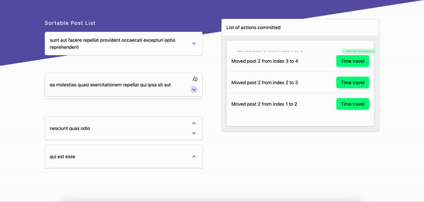

# sortable-post-list



## Setup

This project is initiated with vue cli and vite. it includes support for typescript and uses vitest as the testing library.

## why typescript?

This comes to my take on "testing". For me, it is the thing you set up to know "what" went wrong or better said prevent you from shipping something that might go wrong. With that in mind having something like typescript yelling at me for simple problems makes a lot of sense. This way I won't have to check if the input of the tested function is right, simple things like that.

## Where is the store?

There is no store in this project. As it is a small one and a few global states can handle the whole thing.

## The Time Travel (aka elephant in the room)

There is no doubt that the most special part of this small project is the "Time Travel" section. without that, we just have a pretty list of items getting reordered.

As I saw this as an opportunity to shine, I gave it some thought and found a few solutions. I will explain them below:

### The simple array

The first option coming to mind is using an array adding each snapshot (let's call each post list order a snapshot from now on) to it and rendering it on the page. The newest should come at the top, this will mean all of the items will re-render each time a new snapshot is created. we don't have a choice in that. this is the design. However instead of using `shift` and `unshift`, that can get very expensive computations, like mogul's (people that don't know the magic that is css). I can make the array work with `push` and `pop` and show them in reverse order.

Not the best most innovative of the solutions. However a classic recipe.

### The linked list

This has more finesse to it. Each snapshot itself contains a link to the next snapshot, the beauty of it is, by putting one `link.next` to `null`, you basically get rid of all the newer snapshots. and the cost of it is only a simple assignment. creating a new snapshot is also very easy. I would just need to track the last link somewhere. Not a big deal.
So it would look something like this:

```jsx
// TimeTravelList.vue
<time-travel-item
    @time-travel="handleTimeTravel"
    :time-travel="first"
></time-travel-item>
```

```jsx
// TimeTravelItem.vue
<div>
    <div>{{ timeTravel.text }}</div>
    <button @click="handleTimeTravel">
        Time travel
    </button>
</div>
<time-travel-item
    v-if="timeTravel.next != null"
    :timeTravel="timeTravel.next"
    @time-travel="handleTimeTravelFromChild"
></time-travel-item>
```

```ts
// types.ts
export type TimeTravel = {
  next: TimeTravel | null;
  order: number[];
  id: string;
  text: string;
};
```

Up until this point, this solution seemed very compelling but there are two problems first clicking on each node should delete itself too, so I will need a two-way linked list for this. if having a linked list for this project was not over-engineering, a two-way linked list definitely is.

The second problem is that the vue built-in `<transition-group />` relies on its children keys and I would like to use that for some smooth and easy animations.

### What goes in the Memory?

The first solution that comes to mind is to record the whole `order` of the items. for a list of 5 items and an order that is just keeping 5 numbers it is not the end of the world.

A nicer solution might be keeping the `diff`. Like git does. and then for each time travel, I would have to go from the beginning of the list and apply the changes one by one.

In my opinion, this is good when memory is a constraint and computation power is not so much. again, in the case of having only five items, this is over-engineering. Therefore I am going to go simple and record the whole state:

> Solve a problem when I have a problem

Overthinking and over-engineering are always hiding in the corner.
